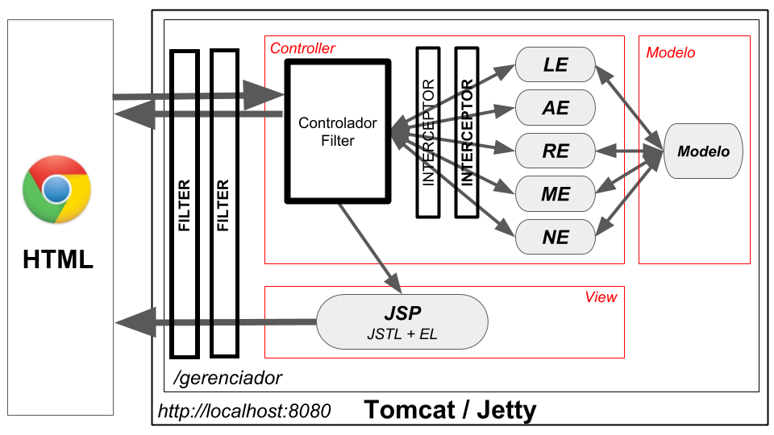

# Aplicação com Servlet + Java 8

## Design da aplicação

A aplicação em si é extremamente simples: um CRUD em memória de Empresas.
As tecnologias utilizadas são:
- especificação Servlet
- Tomcat 9
- Java 8

Ao rodar a aplicação em algum servlet container (por exemplo Tomcat), conseguiremos
acessar 
```http://localhost:8080/gerenciador/controllerServlet?acao=listaEmpresas```

Você será redirecionado para tela de login, use login 'nico' e senha '12345'.
Ao realizar o login, você conseguirá gerir as empresas.

Como a aplicação está estruturada? 

Existem três filtros: monitoramento, autorização e controller, daí as requisições são feitas a partir de uma instância de Acao.

